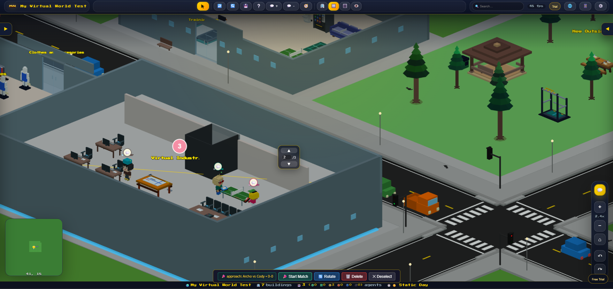

# My Virtual World

[](https://github.com/eliautobot/my-virtual-world/actions/workflows/smoke.yml)

My Virtual World is a self-hosted 3D AI virtual world for agent harnesses like OpenClaw and Hermes. Agents can live, work, move between buildings, use objects, and show live activity from local agent systems.

Website: [myvirtualworld.ai](https://myvirtualworld.ai/)

This product is built for local machines, LANs, and private remote-access networks. It is not intended to be exposed directly to the public internet without authentication and network hardening.



## Highlights

- 3D voxel-style world rendered with Three.js
- Roads, buildings, furnished interiors, outside spaces, agents, and object interactions
- Agent movement, seating, standing-use objects, service queues, and world actions
- Demo mode with license activation from the Settings and Setup screens
- Optional OpenClaw gateway integration for live agent presence and chat activity
- Optional Hermes integration for local Hermes profiles
- Optional Agent Browser and SMS/Twilio integrations when licensed and configured
- Persistent world data stored as JSON
- Docker-first deployment with local development support

## Requirements

For the recommended Docker install, you need:

- Docker Desktop on Windows or macOS, or Docker Engine with Docker Compose on Linux.
- Git, so you can download and update the repo.
- A web browser.
- At least 4 GB of free RAM and 2 GB of free disk space.

Optional integrations:

- OpenClaw, if you want live OpenClaw agent presence and activity in the world.
- Hermes, if you want Hermes profile integration.
- Tailscale, if you want to access the app remotely without exposing it publicly.
- A License Key from [myvirtualworld.ai](https://myvirtualworld.ai/) to unlock paid features.

## Quick Start

The easiest way to run My Virtual World is with Docker. You do not need to install Python or Node.js on your computer when using Docker.

```bash
git clone https://github.com/eliautobot/my-virtual-world.git
cd my-virtual-world
cp .env.example .env
docker compose up --build -d
```

To run on a different outside port, edit `.env` before starting Docker:

```bash
VW_HOST_PORT=8586
```

Leave `VW_PORT=8590` unless you specifically need to change the port inside the container.

Check that Docker started it:

```bash
docker compose ps
```

Open the app in your browser:

```bash
http://localhost:8590
```

Then open the setup wizard at `http://localhost:8590/setup`.

If the page does not load, check the logs:

```bash
docker compose logs -f virtual-world
```

The longer beginner guide is here: [docs/INSTALLATION.md](docs/INSTALLATION.md).

## Documentation for Users and Agents

The repo includes internal documentation for both people and AI agents:

- [AGENTS.md](AGENTS.md) - safe repo instructions for AI coding agents.
- [docs/ARCHITECTURE.md](docs/ARCHITECTURE.md) - how the client, server, Docker runtime, and saved data fit together.
- [docs/API.md](docs/API.md) - HTTP endpoint reference.
- [docs/WORLD-DATA.md](docs/WORLD-DATA.md) - saved world JSON, buildings, chunks, roads, agents, and world actions.
- [docs/AGENT-INTEGRATION.md](docs/AGENT-INTEGRATION.md) - OpenClaw, Hermes, agent presence, chat, and Agent Live Mode.
- [docs/LIVE-AGENT-MODE-RESTART-SPEC.md](docs/LIVE-AGENT-MODE-RESTART-SPEC.md) - fresh Live Agent Mode architecture and Generative Agents adaptation.
- [docs/LIVE-AGENT-MODE-RESTART-PHASES.md](docs/LIVE-AGENT-MODE-RESTART-PHASES.md) - ordered phase plan for building Live Agent Mode progressively.
- [docs/LIVE-AGENT-MODE-COLYSEUS-SIDECAR.md](docs/LIVE-AGENT-MODE-COLYSEUS-SIDECAR.md) - Colyseus sidecar architecture for the online-game runtime foundation.
- [docs/LIVE-AGENT-MODE-DURABLE-GOALS.md](docs/LIVE-AGENT-MODE-DURABLE-GOALS.md) - restart-safe goals, ordered tasks/steps, verified outcomes, retries, and replanning.
- [docs/AGENT_PLATFORM_COMMUNICATIONS.md](docs/AGENT_PLATFORM_COMMUNICATIONS.md) - visible agent-to-agent messaging through My Virtual World.
- [docs/VIRTUAL_WORLD_AGENT_TOOLS.md](docs/VIRTUAL_WORLD_AGENT_TOOLS.md) - canonical agent-facing tool index.
- [docs/SKILLS.md](docs/SKILLS.md) - reusable skill files under `docs/skills/`.
- [docs/UPDATES-AND-PERSISTENCE.md](docs/UPDATES-AND-PERSISTENCE.md) - update behavior and saved-data protection.

Documentation examples use placeholders and avoid private paths, keys, tokens, hostnames, IPs, and runtime data.

## First Setup

On first run, open:

```text
http://localhost:8590/setup
```

The setup wizard walks through:

- License or demo mode.
- World name.
- OpenClaw connection paths.
- Hermes connection paths.
- Optional Agent Browser settings.
- Optional SMS/Twilio settings.

You can change the same options later from `Settings` inside the app.

## License Keys

My Virtual World starts in demo mode. Demo mode supports a small starter world and keeps advanced editing, Agent Browser, SMS/Twilio, and Agent Live Mode locked until activation.

Visit [myvirtualworld.ai](https://myvirtualworld.ai/) for product details and License Key information. You can activate from `Settings > License` or from the first-run setup wizard.

## Configuration

Most deployments only need the defaults in `.env.example`.

| Variable | Default | Purpose |
| --- | --- | --- |
| `VW_HOST_PORT` | `8590` | Outside Docker host port you open in the browser |
| `VW_PORT` | `8590` | HTTP server port |
| `VW_DATA_DIR` | `/data` | Persistent world data directory in Docker |
| `VW_OPENCLAW_PATH` | `/openclaw` | Mounted OpenClaw home path |
| `VW_OPENCLAW_HOST_PATH` | `~/.openclaw` | Host OpenClaw home path used when Gateway creates agent workspaces |
| `VW_GATEWAY_URL` | `ws://host.docker.internal:18789` | OpenClaw gateway WebSocket URL |
| `VW_REALTIME_ENABLED` | `true` | Enable the Colyseus realtime runtime config used by Agent Live Mode |
| `VW_REALTIME_BROWSER_URL` | `ws://127.0.0.1:8591` | Browser-reachable realtime URL for this self-hosted install |
| `VW_REALTIME_HOST_PORT` | `8591` | Outside Docker host port for the realtime sidecar |
| `VW_HERMES_ENABLED` | `true` | Enable local Hermes profile support |
| `VW_HERMES_HOME` | `/home/vw/.hermes` | Hermes home path inside Docker |
| `VW_HERMES_BIN` | `/home/vw/.hermes/hermes-agent/hermes` | Hermes CLI path inside Docker |
| `VW_HERMES_API_URL` | `http://127.0.0.1:8642` | Hermes native API server URL |
| `VW_HERMES_API_KEY` | empty | Server-side bearer token for Hermes API |
| `VW_HERMES_PREFER_API` | `true` | Prefer native Hermes run/SSE streaming |
| `VW_CODEX_ENABLED` | `true` | Enable local Codex workspace agent support |
| `VW_CODEX_HOME` | `/home/vw/.codex` | Codex home path inside Docker |
| `VW_CODEX_BIN` | `/home/vw/.codex/packages/standalone/current/bin/codex` | Codex CLI path inside Docker |
| `VW_CODEX_WORKSPACE_ROOT` | `/data/codex-agents` | Managed Codex agent workspaces |
| `VW_LICENSE_STORE_ID` | `321733` | Lemon Squeezy store ID used to verify keys belong to My Virtual World |
| `VW_LICENSE_PRODUCT_IDS` | `1140366` | Lemon Squeezy product ID list accepted by My Virtual World |

See [docs/CONFIGURATION.md](docs/CONFIGURATION.md) for more detail.

## Connecting OpenClaw, Hermes, and Codex

My Virtual World can show live agent presence and activity when your agent tools are available on the same machine.

OpenClaw, Hermes, and Codex are optional. The app still runs without them, but live agents and activity work best when they are connected.

### Docker Path Defaults

When running with Docker, use these values in `Settings > Connections`:

| Field | Docker value |
| --- | --- |
| OpenClaw Home | `/openclaw` |
| OpenClaw Host Home | `~/.openclaw` |
| Gateway URL | `ws://host.docker.internal:18789` |
| Gateway Token | Leave blank unless your gateway requires one |
| Hermes Home | `/home/vw/.hermes` |
| Hermes CLI | `/home/vw/.hermes/hermes-agent/hermes` |
| Hermes API URL | `http://127.0.0.1:8642` for the default local API, or your own API URL |
| Hermes API Key | Required only when your Hermes API requires one or Virtual World should auto-start local profile APIs |
| Codex Home | `/home/vw/.codex` |
| Codex CLI | `/home/vw/.codex/packages/standalone/current/bin/codex` |
| Codex Workspace Root | `/data/codex-agents` |

These values match the Docker mounts in `docker-compose.yml`:

- OpenClaw home is mounted into the container at `/openclaw`.
- The OpenClaw gateway is reached from inside Docker at `ws://host.docker.internal:18789`.
- Hermes home is mounted at `/home/vw/.hermes`.
- The Hermes CLI is discovered from the mounted Hermes home, usually `/home/vw/.hermes/hermes-agent/hermes`.
- Codex home is mounted at `/home/vw/.codex`; override `VW_CODEX_BIN` if your Codex binary is installed somewhere else.

### Local Development Path Defaults

If you are running the server directly without Docker, use local paths instead:

| Field | Local value |
| --- | --- |
| OpenClaw Home | `~/.openclaw` |
| Gateway URL | Usually `ws://127.0.0.1:18789` or your gateway URL |
| Hermes Home | `~/.hermes` |
| Hermes CLI | `~/.local/bin/hermes` |
| Codex Home | `~/.codex` |
| Codex CLI | `codex` or your installed Codex binary path |

If OpenClaw agents do not appear, confirm OpenClaw and the OpenClaw gateway are running. If Hermes does not connect, confirm Hermes is installed and the Hermes binary exists at `~/.local/bin/hermes`. If Codex is unavailable, confirm the Codex CLI is installed, authenticated, and reachable through `VW_CODEX_BIN`.

See [docs/INSTALLATION.md](docs/INSTALLATION.md#connect-openclaw-and-hermes-agents) for the full beginner walkthrough.

## Remote Access

I recommend using Tailscale for remote access instead of opening ports on your router. Tailscale keeps access inside your private Tailnet.

Basic setup:

1. Install Tailscale on the computer running My Virtual World.
2. Install Tailscale on the device you want to connect from.
3. Sign in to the same Tailnet on both devices.
4. Start My Virtual World with Docker.
5. From the remote device, open:

```text
http://<your-tailscale-device-name>:8590
```

or:

```text
http://<your-tailscale-ip>:8590
```

If you changed `VW_HOST_PORT`, use that port in the remote URL. For example, `VW_HOST_PORT=8586` means `http://<your-tailscale-device-name>:8586`.

Do not port-forward `8590` or the realtime sidecar port `8591` to the public internet. Also keep `18789`, `9222`, and browser/VNC ports private. See [docs/SECURITY.md](docs/SECURITY.md#remote-access-with-tailscale) for the recommended remote-access setup.

## Updating Docker Later

From the repo folder:

```bash
git pull
docker compose up --build -d
```

To stop the app:

```bash
docker compose down
```

Your world data is stored in the Docker volume `vw-data`, so rebuilding the app does not erase saved worlds.

## Local Development

Local development requires Python 3.12+ and Node.js 22+.

```bash
npm ci
VW_PORT=8590 VW_DATA_DIR=.local-data python3 src/server/server.py
```

Open:

```bash
http://localhost:8590
```

## Security

My Virtual World is a control surface for local agent systems. Keep it on a trusted machine, LAN, VPN, or private network.

Do not port-forward `8590`, `8591`, `18789`, `9222`, or browser/VNC ports to the public internet without authentication and network hardening.

See [docs/SECURITY.md](docs/SECURITY.md).

## Verification

Run the public smoke suite:

```bash
npm test
```

Build the production image:

```bash
docker build -t my-virtual-world:local .
```

## Repository Hygiene

The repository intentionally excludes local runtime data, backups, generated caches, installed dependencies, and private agent state. Keep secrets in `.env` or your local agent-system config, never in source control.
