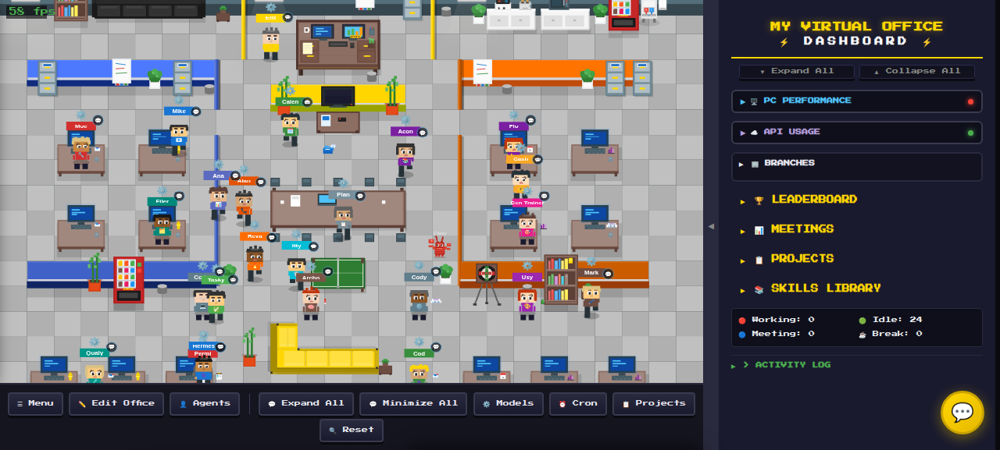

# My Virtual World

[](https://github.com/eliautobot/my-virtual-world/actions/workflows/smoke.yml)

My Virtual World is a self-hosted 3D AI virtual world for agent harnesses like OpenClaw and Hermes. Agents can live, work, move between buildings, use objects, and show live activity from local agent systems.

Website: [myvirtualworld.ai](https://myvirtualworld.ai/)

This product is built for local machines, LANs, and private remote-access networks. It is not intended to be exposed directly to the public internet without authentication and network hardening.



## Highlights

- 3D voxel-style world rendered with Three.js
- Roads, buildings, furnished interiors, outside spaces, agents, and object interactions
- Agent movement, seating, standing-use objects, service queues, and world actions
- Demo mode with license activation from the Settings and Setup screens
- Optional OpenClaw gateway integration for live agent presence and chat activity
- Optional Hermes integration for local Hermes profiles
- Optional Agent Browser and SMS/Twilio integrations when licensed and configured
- Persistent world data stored as JSON
- Docker-first deployment with local development support

## Quick Start

```bash
cp .env.example .env
docker compose up --build -d
open http://localhost:8590
```

Then open the setup wizard:

```bash
open http://localhost:8590/setup
```

## License Keys

My Virtual World starts in demo mode. Demo mode supports a small starter world and keeps advanced editing, Agent Browser, SMS/Twilio, and Agent Live Mode locked until activation.

Visit [myvirtualworld.ai](https://myvirtualworld.ai/) for product details and License Key information. You can activate from `Settings > License` or from the first-run setup wizard.

## Configuration

Most deployments only need the defaults in `.env.example`.

| Variable | Default | Purpose |
| --- | --- | --- |
| `VW_PORT` | `8590` | HTTP server port |
| `VW_DATA_DIR` | `/data` | Persistent world data directory in Docker |
| `VW_OPENCLAW_PATH` | `/openclaw` | Mounted OpenClaw home path |
| `VW_GATEWAY_URL` | `ws://host.docker.internal:18789` | OpenClaw gateway WebSocket URL |
| `VW_HERMES_ENABLED` | `true` | Enable local Hermes profile support |
| `VW_HERMES_HOME` | `/home/vw/.hermes` | Hermes home path inside Docker |
| `VW_HERMES_BIN` | `/home/vw/.local/bin/hermes` | Hermes CLI path inside Docker |

See [docs/CONFIGURATION.md](docs/CONFIGURATION.md) for more detail.

## Local Development

Local development requires Python 3.12+ and Node.js 22+.

```bash
npm ci
VW_PORT=8590 VW_DATA_DIR=.local-data python3 src/server/server.py
```

Open:

```bash
http://localhost:8590
```

## Security

My Virtual World is a control surface for local agent systems. Keep it on a trusted machine, LAN, VPN, or private network.

Do not port-forward `8590`, `18789`, `9222`, or browser/VNC ports to the public internet without authentication and network hardening.

See [docs/SECURITY.md](docs/SECURITY.md).

## Verification

Run the public smoke suite:

```bash
npm test
```

Build the production image:

```bash
docker build -t my-virtual-world:local .
```

## Repository Hygiene

The repository intentionally excludes local runtime data, backups, generated caches, installed dependencies, and private agent state. Keep secrets in `.env` or your local agent-system config, never in source control.
